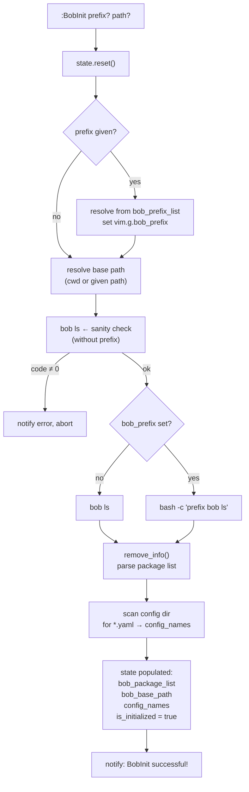
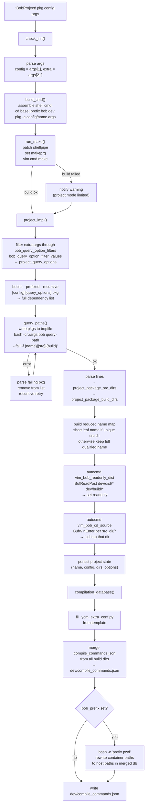
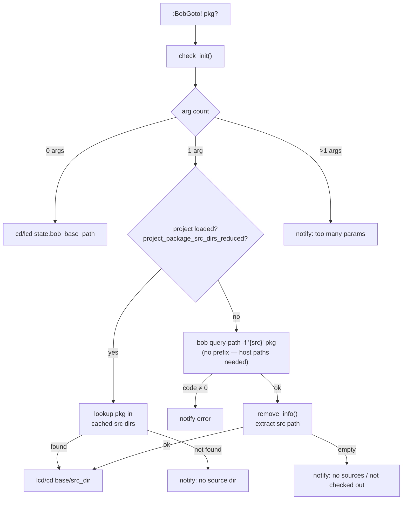

# nvim-bob 

[](https://github.com/mthier/nvim-bob/actions/workflows/ci.yml)

Neovim plugin for working in a [Bob Build Tool](https://github.com/BobBuildTool/bob) environment.
Lua reimplementation of [vim-bob](https://github.com/ThomasFeher/vim-bob).

## Features

- **Build packages** via `:make` with full quickfix integration
- **Tab completion** for package names, config names, and common build flags
- **Project mode** — maps all recursive package dependencies, sets up `lcd` autocommands so the working directory always follows the open file
- **Dependency graph** — renders a Bob dependency graph and opens it automatically (`dot` or `d3`)
- **LSP / clangd support** — merges per-package `compile_commands.json` files into a single aggregate database and generates a `.ycm_extra_conf.py`
- **Container support** — prefix all Bob invocations with an arbitrary command (e.g. `docker exec …`) via `vim.g.bob_prefix`

## Requirements

- Neovim ≥ 0.12.0
- [Bob Build Tool](https://github.com/BobBuildTool/bob) available in `$PATH`
- `dot` (Graphviz) — only needed for `BobGraph` with `bob_graph_type = "dot"`

## Installation

**[lazy.nvim](https://github.com/folke/lazy.nvim)**

```lua
{
    "mthier/nvim-bob",
    opts = {
        bob_config_path = "configurations",
    },
}
```

**Local (Development)**

```lua
{
    "nvim-bob",
    dev = true,
    dir = "~/Workspace/nvim-bob",
    name = "nvim-bob",
    config = function()
        require("nvim-bob").setup({
            bob_config_path = "configurations",
            bob_graph_type = "dot",
            bob_auto_complete_items = {'-DBUILD_TYPE=Release',
                                       '-DBUILD_TYPE=Debug',
                                       '-DBUILD_SCRIPT_AS_SYMLINK=TRUE',
                                       '--destination dist_folder'}
        })
    end,
}
```

**[packer.nvim](https://github.com/wbthomason/packer.nvim)**

```lua
use {
    "mthier/nvim-bob",
    config = function()
        require("nvim-bob").setup({
            bob_config_path = "configurations",
        })
    end,
}
```

## Configuration

Call `setup()` with any options you want to override. All keys are optional.

```lua
require("nvim-bob").setup({
    -- Relative path (from the Bob workspace root) to the directory containing
    -- YAML build configuration files. Config names are offered as tab
    -- completions for :BobProject and :BobDev.
    bob_config_path = "configurations",

    -- Graph output format passed to `bob graph -t`. Either "dot" (rendered
    -- to PNG via Graphviz and opened with xdg-open) or "d3" (HTML, opened
    -- directly with xdg-open).
    bob_graph_type = "dot",

    -- Extra items appended to tab completion for :BobProject / :BobDev.
    bob_auto_complete_items = {
        "-DBUILD_TYPE=Release",
        "-DBUILD_TYPE=Debug",
        "-DBUILD_SCRIPT_AS_SYMLINK=TRUE",
        "--destination dist_folder",
    },

    -- Named prefix commands selectable via tab completion in :BobInit.
    -- Keys are display names, values are the full shell prefix string.
    bob_prefix_list = {
        none = "",
        ["my-container"] = "docker run --rm -v $(pwd):/build my-container",
    },

    -- Lua patterns for bob dev options that must be stripped before
    -- passing arguments to `bob query-path`.
    bob_query_option_filters = {
        "^%-b$",
        "^%-%-build%-only$",
        "^%-%-clean$",
        "^%-%-force$",
        "^%-%-upload$",
        "^%-%-destination$",
        "^%-%-download$",
    },

    -- Two-part options stripped before `bob query-path` (these consume
    -- the next argument as their value).
    bob_query_option_filter_values = { "--destination", "--download" },
})
```

## Commands

| Command | Description |
|---|---|
| `:BobInit [prefix] [path]` | Initialize the plugin for the Bob workspace at `path` (defaults to `cwd`). Optionally sets a `prefix` command (e.g. `docker run …`) for all Bob invocations. Discovers all available packages and configuration names. Must be run before any other command. |
| `:BobClean` | Delete the `dev/build` and `dev/dist` directories. |
| `:BobDev[!] <pkg> [args…]` | *(not yet implemented)* |
| `:BobProject[!] <pkg> [config] [args…]` | Build `pkg` with `bob dev`, then set up project mode: discovers all recursive package dependencies, maps source/build directories, creates per-directory `lcd` autocommands, and regenerates `dev/compile_commands.json`. |
| `:BobGoto[!] [pkg]` | Change directory into the source directory of `pkg`. With no argument, goes to the workspace root. `!` uses global `cd`; without `!` uses `lcd` (window-local). |
| `:BobGraph` | Generate and open the dependency graph for the current project. Requires a prior `:BobProject` run. |
| `:BobStatus` | *(not yet implemented)* |
| `:BobSearch[!] [pattern]` | *(not yet implemented)* |

### Tab completion

- `:BobInit` completes **prefix strings** from `bob_prefix_list` as the first argument.
- `:BobProject` and `:BobDev` complete **package names** as the first argument, **config names** as the second argument, and `bob_auto_complete_items` for all further arguments.
- `:BobGoto` completes package names. After a `:BobProject` run, completion is restricted to the packages that are part of the project (using short leaf names where unambiguous).

## Global variables

| Variable | Default | Description |
|---|---|---|
| `vim.g.bob_prefix` | `""` | Shell prefix prepended to every Bob invocation (e.g. `"docker exec -it mycontainer"`). When set, container-side paths in `compile_commands.json` are automatically translated to their host equivalents. |
| `vim.g.bob_verbose` | `0` | Set to `1` to enable verbose logging of internal Bob queries. |

## Typical workflow

```
# 1. Open Neovim inside (or point to) a Bob workspace
:BobInit

# 2. Build a package and enter project mode
#    (sets up source navigation and regenerates compile_commands.json)
:BobProject myapp native -DBUILD_TYPE=Debug

# 3. Navigate to a dependency's source
:BobGoto mylib

# 4. Rebuild at any time via the standard :make interface
:make
# or re-run the full project build
:BobProject! myapp native -DBUILD_TYPE=Debug

# 5. Visualise the dependency graph
:BobGraph
```

## Internal flow

### `:BobInit [prefix] [path]`



### `:BobProject[!] pkg [config] [args…]`



### `:BobGoto[!] [pkg]`

> `!` uses global `cd`; without `!` uses window-local `lcd`.



## Container builds

Set `vim.g.bob_prefix` to any wrapper command. The plugin uses the prefix for
`bob dev` invocations (build), but **not** for `bob query-path` (path
resolution), so that source and build paths are always valid on the host where
Neovim and language servers run.

```lua
-- Example: build inside a Docker container
vim.g.bob_prefix = "docker exec -it my-build-container"
```

After a `:BobProject` run, container-side paths in `compile_commands.json` are
replaced with the corresponding host paths so that clangd and YouCompleteMe
work without further configuration.
